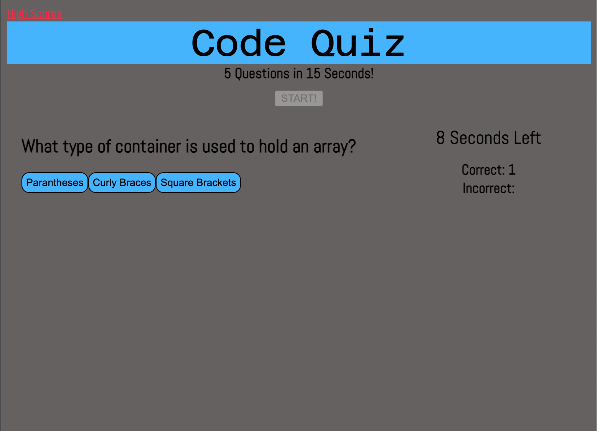

# Code Quiz

### Challenges
My main challenge in this assignment was appending the answer buttons to the questions. Initially, I had the function nested inside of my timer function which had the buttons appear during each second as opposed to only once. That small edit made quite the difference!

Another roadblock I faced was being able to have the selected answer return a right or wrong result. Aside from the uncertainty of to make this work, I am happy to see the questions changing after every selected button.

https://github.com/cah4758/code-quiz-time
[GitHub-Repo]

https://cah4758.github.io/code-quiz-time/
[Deployed-App]

